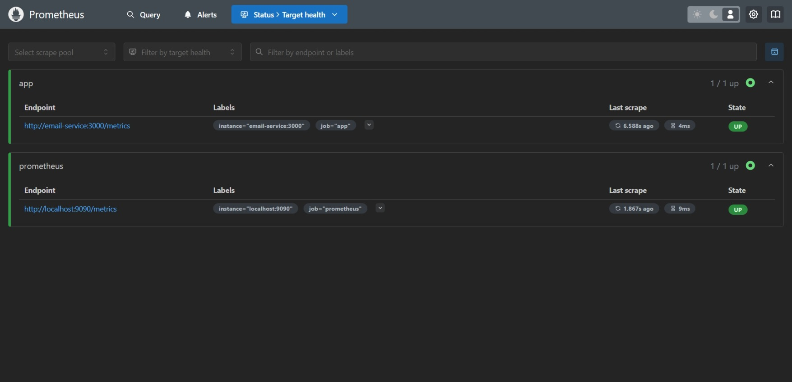
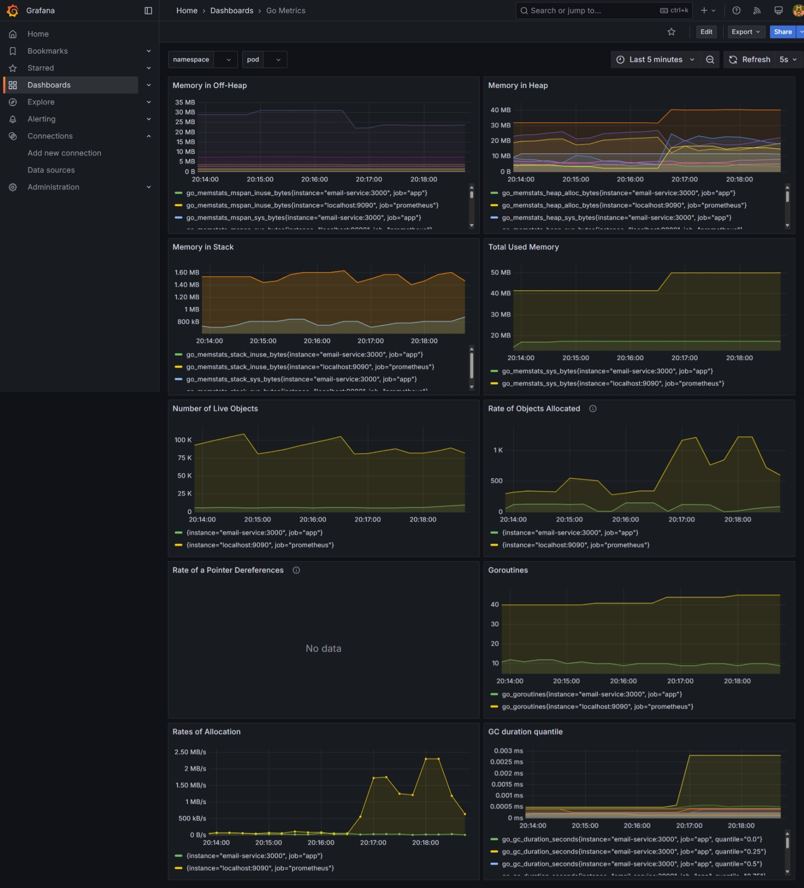
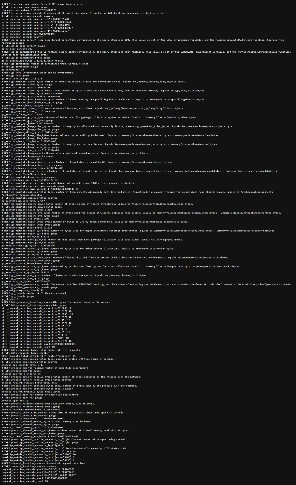

# Monitoring and Logging with Prometheus, Grafana, and Alertmanager

This project demonstrates how to set up monitoring and logging for your application using **Prometheus**, **Grafana**, and **Alertmanager**. It tracks application performance metrics such as CPU usage, HTTP request counts, and request durations, and sends alerts for critical conditions.

## Table of Contents

- [Overview](#overview)
- [Prerequisites](#prerequisites)
- [Setup](#setup)
- [Configuration](#configuration)
  - [Prometheus Configuration](#prometheus-configuration)
  - [Alert Configuration](#alert-configuration)
  - [Docker Compose Configuration](#docker-compose-configuration)
  - [Application Metrics (Go Code)](#application-metrics-go-code)
  - [Alertmanager Setup](#alertmanager-setup)
  - [Grafana Setup](#grafana-setup)
- [Testing](#testing)
- [Screenshots](#screenshots)

## Overview

This repository sets up Prometheus and Grafana for monitoring your application and Alertmanager for sending alerts based on predefined conditions like high CPU usage, slow requests, or error rates.

### Key Components:
1. **Prometheus**: Collects and stores metrics.
2. **Grafana**: Visualizes metrics in dashboards.
3. **Alertmanager**: Sends notifications based on Prometheus alerts.

## Prerequisites

Ensure you have the following installed:
- Docker
- Docker Compose

## Setup

1. Clone the repository:
   ```bash
   git clone https://github.com/lokesh2201013/monitoring-logging.git
   cd monitoring-logging
   ```
Build and start the services using Docker Compose:
```bash
docker-compose up -d
```
This will start the following services:

Prometheus: Accessible at http://localhost:9090

Grafana: Accessible at http://localhost:3001

Alertmanager: Accessible at http://localhost:9093

Email Service: Accessible at http://localhost:3000

Postgres: Running for your email service database

Configuration

Prometheus Configuration

Your prometheus.yml configuration file is set to scrape the following targets:

App (email-service): email-service:3000
 
```bash  

scrape_interval: 15s

scrape_configs:
  - job_name: 'prometheus'
    static_configs:
      - targets: ['localhost:9090']

  - job_name: 'app'
    static_configs:
      - targets: ['email-service:3000']

rule_files:
  - "prometheus_alerts.yml"

alerting:
  alertmanagers:
    - static_configs:
        - targets: ["alertmanager:9093"]
```
Alert Configuration
The prometheus_alerts.yml file defines critical alerts for:

High CPU %

High req duration

High error rates (5xx resp)

yaml

```bash
groups:
  - name: example_alerts
    rules:
      - alert: HighCPUUsage
        expr: cpu_usage_percentage > 90
        for: 30s
        labels:
          severity: critical
        annotations:
          summary: "CPU usage is above 90% for last 30sec"
      
      - alert: HighReqDuration
        expr: http_request_duration_seconds_sum / http_request_duration_seconds_count > 2  
        for: 30s
        labels:
          severity: critical
        annotations:
          summary: "High average request duration > 2s for 30s"

      - alert: HighErr%
        expr: rate(http_requests_total{status=~"5.."}[30s]) > 0.1
        for: 30s
        labels:
          severity: critical
        annotations:
          summary: "High error rate of server side 5xx > 0.1/s for 30s"
```
Docker Compose Configuration
The docker-compose.yml file defines services for:

Prometheus: The metrics scraper.

Grafana: The dashboard viewer.

Alertmanager: Handles alerts and sends notifications.

Email Service: Your application service.

Postgres: The database used by the email service.

yaml
```bash

services:
  prometheus:
    image: prom/prometheus:latest
    container_name: prometheus
    volumes:
      - ./prometheus.yml:/etc/prometheus/prometheus.yml
      - ./prometheus_alerts.yml:/etc/prometheus/prometheus_alerts.yml
    ports:
      - "9090:9090"
    depends_on:
      - alertmanager

  alertmanager:
    image: prom/alertmanager:latest
    container_name: alertmanager
    volumes:
      - ./alertmanager.yml:/etc/alertmanager/alertmanager.yml
    ports:
      - "9093:9093"

  grafana:
    image: grafana/grafana:latest
    container_name: grafana
    ports:
      - "3001:3000"
    depends_on:
      - prometheus

  email-service:
    build: .
    ports:
      - "3000:3000"
    env_file:
      - .env
    restart: always

  postgres:
    image: postgres:latest
    container_name: postgres
    restart: always
    environment:
      POSTGRES_USER: ${DB_USER}
      POSTGRES_PASSWORD: ${DB_PASSWORD}
      POSTGRES_DB: ${DB_NAME}
    ports:
      - "${DB_PORT}:5432"
```
Application Metrics (Go Code)
The application collects and exposes metrics through the /metrics endpoint. These include:

HTTP request counts

CPU usage

Request duration
```bash
app.Get("/metrics", func(c *fiber.Ctx) error {
    c.Set("Content-Type", "text/plain")
    handler := promhttp.Handler()
    fasthttpadaptor.NewFastHTTPHandler(handler)(c.Context())
    return nil
})
```
Alertmanager Setup
Alertmanager is configured to send email alerts when conditions are met. Ensure you configure your email settings in alertmanager.yml.

yaml
Copy
Edit
```bash
route:
  receiver: 'email'

receivers:
  - name: 'email'
    email_configs:
      - to: 'your-email@example.com'
        from: 'from-email@example.com'
        smarthost: 'smtp.example.com:587'
        auth_username: 'your-email@example.com'
        auth_password: 'your-email-password'
        require_tls: true
```
Grafana Setup

Login: Use default credentials admin/admin.

Add Data Source: Add Prometheus as the data source in Grafana.

Create Dashboard: Visualize CPU usage, request counts, and durations.

Screenshots

After successful setup, you should see the following:

Prometheus Dashboard: Viewing collected metrics.

Grafana Dashboard: Visualizations of the application's 

performance.

Alert Notifications: Alerts triggered based on CPU usage, request duration, and error rates.







