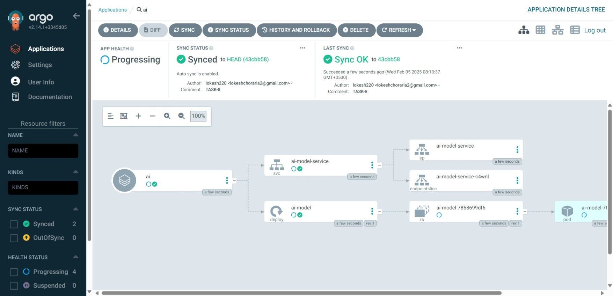
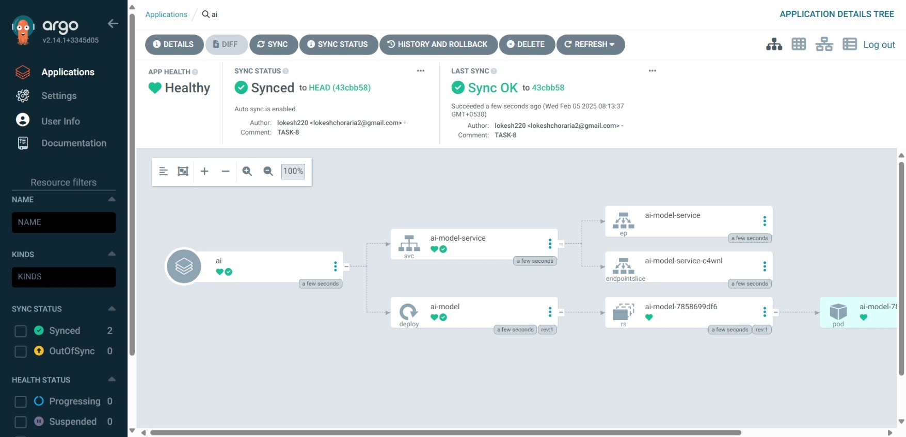
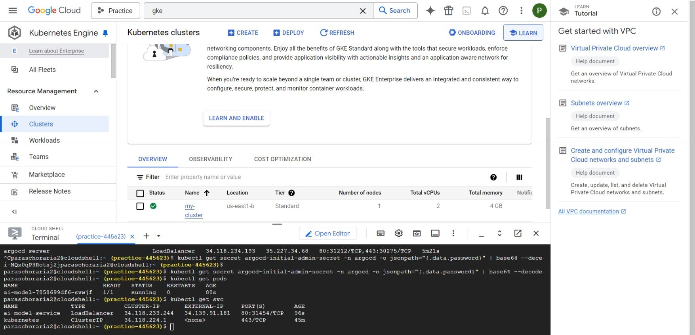

## 1. Prepare Your AI Model Docker Image
Create a Dockerfile
Make sure your AI model is containerized. Below is a sample Dockerfile:

```dockerfile
FROM python:3.9

WORKDIR /app

COPY requirements.txt .
RUN pip install --no-cache-dir -r requirements.txt

COPY . .

EXPOSE 5000

CMD ["python", "app.py"]
```
Build and Push Docker Image
Replace us-central1-docker.pkg.dev/ai-model-project/ai-model-repo/ai with your actual registry path.

```sh
docker build -t us-central1-docker.pkg.dev/ai-model-project/ai-model-repo/ai .
docker push us-central1-docker.pkg.dev/ai-model-project/ai-model-repo/ai
```
2. Define Kubernetes Manifests
deployment.yaml
```yaml
apiVersion: apps/v1
kind: Deployment
metadata:
  name: ai-model
spec:
  replicas: 2
  selector:
    matchLabels:
      app: ai-model
  template:
    metadata:
      labels:
        app: ai-model
    spec:
      containers:
      - name: ai-model
        image: us-central1-docker.pkg.dev/ai-model-project/ai-model-repo/ai
        ports:
        - containerPort: 5000
```
service yaml
```
service.yaml
yaml
Copy
Edit
apiVersion: v1
kind: Service
metadata:
  name: ai-model-service
spec:
  selector:
    app: ai-model
  ports:
    - protocol: TCP
      port: 80
      targetPort: 5000
  type: LoadBalancer
```
ingress.yaml (Optional)
If using an ingress controller:

```yaml

apiVersion: networking.k8s.io/v1
kind: Ingress
metadata:
  name: ai-model-ingress
spec:
  rules:
  - host: ai-model.example.com
    http:
      paths:
      - path: /
        pathType: Prefix
        backend:
          service:
            name: ai-model-service
            port:
              number: 80
```

### 3. Deploy with ArgoCD
Install ArgoCD in Kubernetes
```sh
kubectl create namespace argocd
kubectl apply -n argocd -f https://raw.githubusercontent.com/argoproj/argo-cd/stable/manifests/install.yaml
```
Access ArgoCD UI
```sh
kubectl port-forward svc/argocd-server -n argocd 8080:443
```
Go to https://localhost:8080 and log in using:

```sh
kubectl -n argocd get secret argocd-initial-admin-secret -o jsonpath="{.data.password}" | base64 -d
```
### 4. Create ArgoCD Application
argocd-app.yaml

```yaml
apiVersion: argoproj.io/v1alpha1
kind: Application
metadata:
  name: ai-model-app
  namespace: argocd
spec:
  destination:
    namespace: default
    server: https://kubernetes.default.svc
  project: default
  source:
    repoURL: https://github.com/lokesh2201013/small-task/Task-8/ai-model-k8s
    targetRevision: main
    path: manifests
  syncPolicy:
    automated:
      prune: true
      selfHeal: true
Apply it:
```

```sh
kubectl apply -f argocd-app.yaml
```
### 5. Verify Deployment
Check if the pods are running:

```sh
kubectl get pods

Get the service external IP:


kubectl get svc ai-model-service

Test the endpoint:


curl http://<EXTERNAL-IP>
```
✅ Deliverables

✅ Dockerfile

✅ deployment.yaml, service.yaml, ingress.yaml

✅ argocd-app.yaml

✅ Steps to deploy





