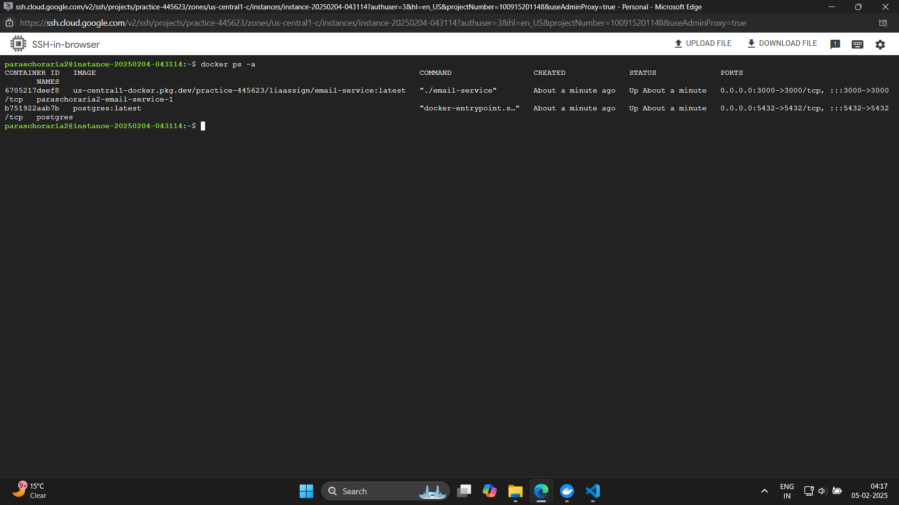

# For this task images are in  images folder 
# Task 1 and 2 have been combined for efficency and time management reasons
# 1. Cloud Infrastructure & Deployment (GCP)

Architecture Diagram
Your setup consists of the following components:

Google Artifact Registry: Stores Docker images.

GCP Virtual Machine (Compute Engine): Runs the application and database.

PostgreSQL (Dockerized): The backend database running on the same VM.

Google Cloud SDK: Used for authentication and deployment automation.

Docker & Docker Compose: Manages application containers.
GitHub Actions CI/CD: Automates build, scan, push, and deployment.

Here’s a simple architecture diagram:
```
 +----------------------------+
                                |      Public Internet       |
                                +------------+---------------+
                                             |
                                             | Public IP
                  + ---------------------------+----------------------------+
                  |     |          Public VPC (Firewall)            |      |
                  |     |    (Restrict Access to Port 3000)         |      |
                  |     +---------------------+----------------------+     |
                  |                           |                            |
                  |  +------------------------+------------------------+   |
                  |  |          VM Instance with Docker Containers    |    |
                  |  |        (Backend & PostgreSQL in Docker)        |    |
                  | +------------------------+------------------------+    |
                  |                          |                              |
                  ----------------------------------------------------------
                             +----------------+-----------------------+
                             |    Google Artifact Registry           |
                             | (Storing and retrieving Docker Images) |
                             +----------------+-----------------------+
                                             |
                                             | CI/CD Pipeline
                             +---------------+----------------------+
                             | GitHub Actions CI/CD Pipeline      |
                             | (Build, Test, Deploy to VM)        |
                             +-------------------------------------+
```
```
 Developer → GitHub → GitHub Actions (CI/CD)
       |            |
       |            ├──> Build Docker Image
       |            ├──> Scan for Vulnerabilities
       |            ├──> Push to Google Artifact Registry
       |            ├──> SSH into GCP VM
       |            ├──> Pull and Deploy using Docker Compose
       |
   GCP VM (Compute Engine) [Docker Containers]
       ├──> Email Service (Go)
       ├──> PostgreSQL Database
```
Steps to Deploy the Application on GCP VM

Step 1: Create a GCP Compute Engine VM

Go to the GCP Console → Compute Engine → VM Instances.

Click Create Instance and configure:

Name: email-service-vm

Region: us-central1

Machine Type: e2-medium (2 vCPU, 4GB RAM)

OS: Ubuntu 22.04 LTS

Firewall: Enable HTTP & HTTPS traffic

Step 2: Install Required Software on the VM

SSH into the VM and install dependencies:

```bash
sudo apt update && sudo apt upgrade -y
sudo apt install -y docker.io docker-compose unzip
Enable Docker:
```
``` bash
sudo systemctl enable docker
sudo usermod -aG docker $USER
```
Logout and log back in for the changes to take effect.

Step 3: Configure Google Cloud SDK
Authenticate and configure the Google Cloud SDK:

```bash

gcloud auth login
gcloud auth configure-docker us-central1-docker.pkg.dev
```
Step 4: Setup Docker Compose File on the VM
Create a docker-compose.yml:

yaml
```
version: '3.8'

services:
  email-service:
    image: us-central1-docker.pkg.dev/practice-445623/liaassign/email-service:latest
    ports:
      - "3000:3000"
    env_file:
      - .env
    restart: always
    depends_on:
      - postgres

  postgres:
    image: postgres:latest
    container_name: postgres
    restart: always
    environment:
      POSTGRES_USER: ${DB_USER}
      POSTGRES_PASSWORD: ${DB_PASSWORD}
      POSTGRES_DB: ${DB_NAME}
    ports:
      - "${DB_PORT}:5432"
    volumes:
      - ./init.sql:/docker-entrypoint-initdb.d/init.sql
      - postgres_data:/var/lib/postgresql/data

volumes:
  postgres_data:
```
Start the application:

```bash
docker-compose up -d
```
Step 5: Expose the Application to the Public
If your application listens on port 3000, allow traffic:

```bash

gcloud compute firewall-rules create allow-web --allow tcp:3000 --source-ranges=0.0.0.0/0

Now, you can access the service via

http://<GCP_VM_EXTERNAL_IP>:3000.
```

GCP Configurations Used

Compute Engine VM: Runs the application.

Google Artifact Registry: Stores Docker images.

Firewall Rules: Opened port 3000 for public access.

IAM & Security:

Service account for GitHub Actions with Artifact 

Registry Writer permissions.

Secure environment variables managed via GitHub Secrets.

# 2. CI/CD Pipeline Implementation using GitHub Actions
CI/CD Pipeline YAML
``` bash
name: Build, Scan, Push, and Deploy Docker Image to GCP VM

on:
  push:
    branches:
      - main  

jobs:
  build_scan_push_deploy:
    runs-on: ubuntu-latest
    steps:
      - name: Checkout repository
        uses: actions/checkout@v2

      - name: Set up Docker Buildx
        uses: docker/setup-buildx-action@v2

      - name: Set up Google Cloud SDK
        uses: google-github-actions/setup-gcloud@v1
        with:
          project_id: ${{ secrets.GCP_PROJECT_ID }}
          credentials_json: ${{ secrets.GCP_SA_KEY }}

      - name: Log in to Google Artifact Registry
        run: |
          gcloud auth configure-docker us-central1-docker.pkg.dev

      - name: Build Docker Image
        run: |
          docker build -t us-central1-docker.pkg.dev/${{ secrets.GCP_PROJECT_ID }}/liaassign/email-service:latest ./Task1and2/

      - name: Security Scans (Trivy & OWASP Dependency Check)
        run: |
          # Run Trivy Image Scan
          docker run --rm -v /var/run/docker.sock:/var/run/docker.sock aquasec/trivy:latest \
            --no-progress --exit-code 1 --security-checks vuln \
            --image us-central1-docker.pkg.dev/${{ secrets.GCP_PROJECT_ID }}/liaassign/email-service:latest || true

          # Run OWASP Dependency Check
          mkdir -p dependency-check
          docker run --rm -v $(pwd)/dependency-check:/report owasp/dependency-check \
            --scan /github/workspace --format HTML --out /report || true

      - name: Push Docker Image to Google Artifact Registry
        run: |
          docker push us-central1-docker.pkg.dev/${{ secrets.GCP_PROJECT_ID }}/liaassign/email-service:latest

      - name: SSH to GCP VM via IAP and Deploy
        run: |
          gcloud compute ssh ${{ secrets.GCP_VM_USER }}@instance-20250204-043114 \
            --tunnel-through-iap \
            --zone=us-central1-c \
            --command "
              gcloud auth configure-docker us-central1-docker.pkg.dev
              docker-compose pull
              docker-compose down
              docker-compose up -d
            "
```

Pipeline Explanation

### 1. Checkout Repository
Pulls the latest code from the main branch.

### 2. Set Up Docker Buildx
Enables Docker Buildx for multi-platform builds.

### 3. Authenticate Google Cloud SDK
Uses GitHub Secrets (GCP_PROJECT_ID, GCP_SA_KEY) to log in.

### 4. Build Docker Image
Creates a new Docker image from the Task1and2/ directory.

### 5. Security Scanning
Trivy: Checks for vulnerabilities in the built image.

OWASP Dependency Check: Analyzes project dependencies for known vulnerabilities.

### 6. Push Image to Google Artifact Registry
Uploads the image to us-central1-docker.pkg.dev.

### 7. SSH to GCP VM & Deploy
Uses gcloud compute ssh with Identity-Aware Proxy (IAP) to:
Authenticate Docker.
Pull the latest image.
Restart the application using Docker Compose.
Managing Secrets & Environment Variables
GitHub Secrets:

GCP_PROJECT_ID: GCP Project ID.

GCP_SA_KEY: JSON key for GCP service account.

GCP_VM_USER: VM username.

Environment Variables (.env file):


DB_USER, DB_PASSWORD, DB_NAME, DB_PORT for PostgreSQL.

Final Deliverables

✅ Architecture Diagram

✅ Deployment Steps on GCP VM

✅ GCP Configurations (Compute Engine, Artifact Registry, Firewall Rules, IAM)

✅ CI/CD Pipeline YAML & Explanation

✅ Github Secrets Management Best Practices


